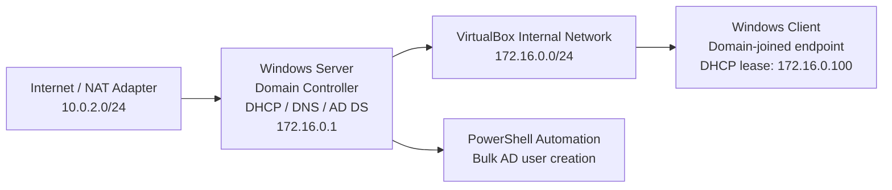
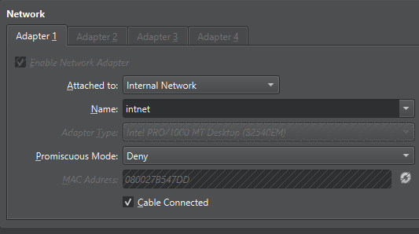
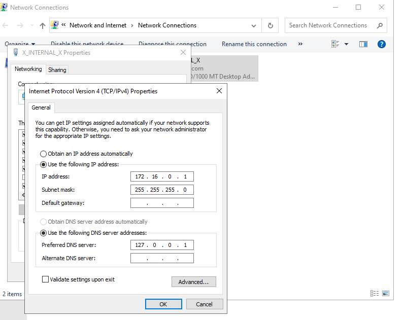
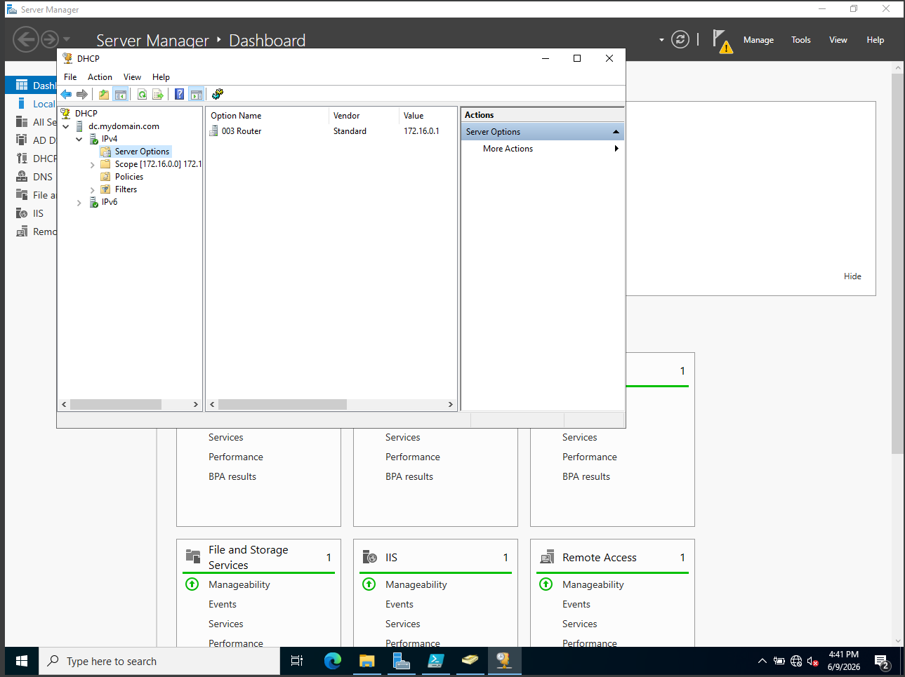
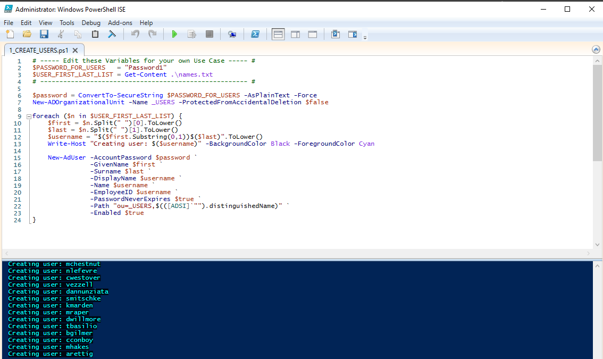
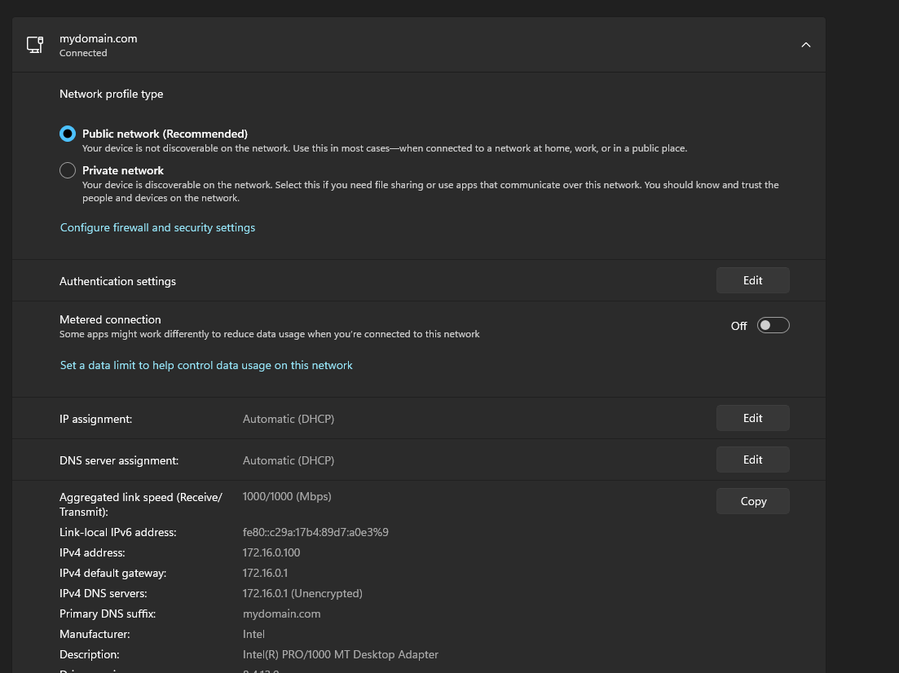
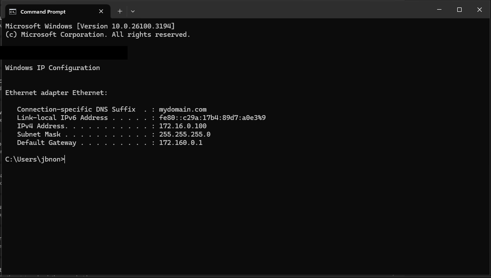
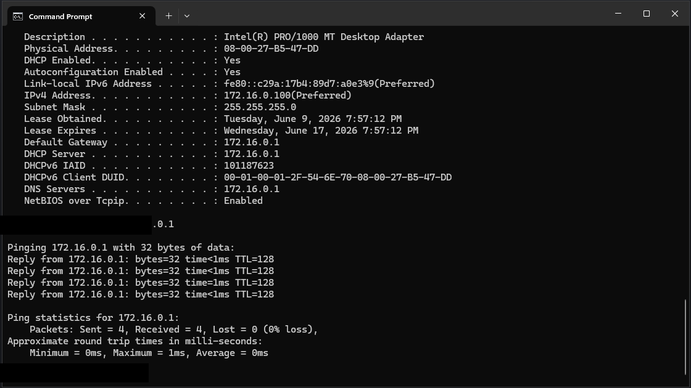

# Active Directory Home Lab: Domain Services, DHCP, DNS, and Automated User Provisioning

## Executive Summary

Built a Windows Server Active Directory lab in Oracle VirtualBox to simulate a small enterprise identity and network services environment. The lab demonstrates domain controller deployment, private network segmentation, DHCP/DNS configuration, Windows client domain connectivity, and PowerShell-based user provisioning.

This project was completed as a practical infrastructure exercise to strengthen hands-on skills in Windows Server administration, identity management, endpoint networking, and repeatable operational scripting.

## What This Lab Demonstrates

- Deployed and configured a Windows Server domain controller for `mydomain.com`.
- Configured an isolated VirtualBox internal network for controlled lab traffic.
- Assigned static addressing to the domain controller and validated client DHCP leases.
- Configured DHCP scope options including default gateway and DNS.
- Joined a Windows client to the domain network and validated name/IP configuration.
- Automated Active Directory user creation from a name list using PowerShell.
- Verified network reachability between client and domain controller.

## Business Value

This lab models the core infrastructure many organizations rely on every day: centralized authentication, managed IP addressing, internal DNS, and repeatable account provisioning. The work shows the ability to build, troubleshoot, and document foundational IT services that support onboarding, endpoint access, and secure network operations.

For a hiring manager, the key signal is not only that the lab works, but that the environment was validated with evidence, repeatable scripts, and clear operational documentation.

## Architecture

## Environment

| Component | Implementation |
| --- | --- |
| Hypervisor | Oracle VirtualBox |
| Server | Windows Server domain controller |
| Client | Windows 11 virtual machine |
| Domain | `mydomain.com` |
| Internal subnet | `172.16.0.0/24` |
| Domain controller | `172.16.0.1` |
| Client lease example | `172.16.0.100` |
| Services | AD DS, DNS, DHCP, Remote Access/IIS roles visible in Server Manager |
| Automation | PowerShell AD user provisioning |

## Evidence

### Internal Lab Network

### Domain Controller Static IP

### DHCP Server Option

### Automated User Provisioning

### Client DHCP Lease

### Client IP Configuration

### Connectivity Validation

## Implementation Notes

1. Created an isolated internal network in VirtualBox for the Active Directory lab.
2. Configured the Windows Server VM with a static internal IP address.
3. Installed and promoted the server to a domain controller.
4. Configured DNS and DHCP services for the internal subnet.
5. Verified that the Windows client received the correct DHCP lease, DNS server, default gateway, and domain suffix.
6. Used PowerShell to bulk-create Active Directory users from a text file.
7. Validated connectivity from the Windows client to the domain controller with ICMP testing.

## Operational Skills Practiced

- Windows Server administration
- Active Directory Domain Services
- DNS and DHCP configuration
- IPv4 subnetting and gateway configuration
- Virtualized lab networking
- PowerShell automation
- Basic infrastructure troubleshooting
- Technical documentation for operational handoff

## Repository Contents

| Path | Purpose |
| --- | --- |
| `README.md` | Portfolio-ready project summary and evidence |
| `docs/runbook.md` | Repeatable build and validation notes |
| `scripts/New-LabUsers.ps1` | Safer reusable AD user provisioning script |
| `scripts/sample-names.txt` | Example input format for user provisioning |
| `assets/screenshots/` | Sanitized lab evidence images |

## Future Improvements

- Add Group Policy Objects for password policy, lockout policy, and desktop restrictions.
- Add organizational units for departments and role-based administration.
- Implement security groups and least-privilege access patterns.
- Add Windows Event Forwarding or basic SIEM ingestion for authentication logs.
- Document backup and restore steps for Active Directory recovery.

## Reference

This lab was inspired by a hands-on Active Directory tutorial: [YouTube reference](https://www.youtube.com/watch?v=MHsI8hJmggI&t=3444s). The implementation and documentation here are written as a professional portfolio case study with sanitized evidence and reusable administration artifacts.
